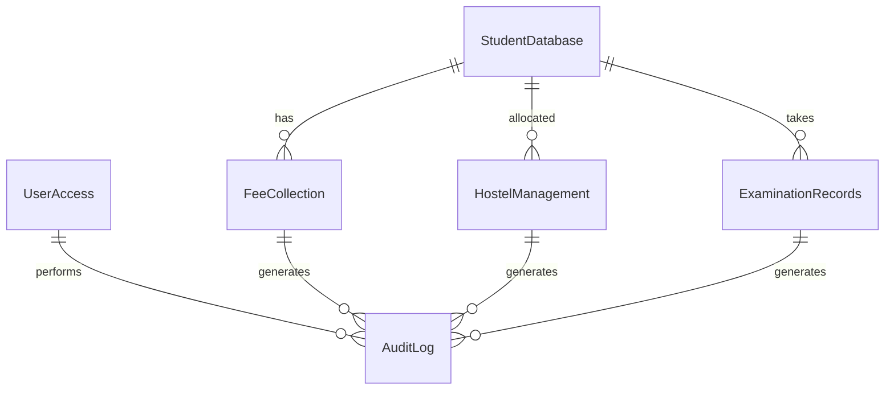

# Educational Institution ERP - Technical Documentation

## Table of Contents

1. [System Architecture](#system-architecture)
2. [Database Schema](#database-schema)
3. [API Reference](#api-reference)
4. [Security Implementation](#security-implementation)
5. [Integration Architecture](#integration-architecture)
6. [Performance Optimization](#performance-optimization)
7. [Deployment Architecture](#deployment-architecture)
8. [Monitoring & Logging](#monitoring--logging)

## System Architecture

### High-Level Architecture

```
┌─────────────────────────────────────────────────────────────┐
│                    Presentation Layer                       │
├─────────────────────────────────────────────────────────────┤
│  Google Forms  │  Web Portal  │  Mobile App  │  Admin UI   │
└─────────────────────────────────────────────────────────────┘
                                │
                                ▼
┌─────────────────────────────────────────────────────────────┐
│                    Application Layer                         │
├─────────────────────────────────────────────────────────────┤
│  Google Apps Script  │  Automation  │  Integration Layer   │
└─────────────────────────────────────────────────────────────┘
                                │
                                ▼
┌─────────────────────────────────────────────────────────────┐
│                     Data Layer                              │
├─────────────────────────────────────────────────────────────┤
│  Google Sheets  │  Google Drive  │  External APIs          │
└─────────────────────────────────────────────────────────────┘
```

### Component Details

#### Frontend Components
- **Google Forms**: Student-facing forms for applications and data entry
- **Web Portal**: Administrative interface for staff and management
- **Mobile Interface**: Responsive design for mobile access
- **Dashboard**: Real-time analytics and reporting interface

#### Backend Components
- **Google Apps Script**: Server-side logic and automation
- **Google Sheets**: Primary database and data storage
- **Google Drive**: File storage and document management
- **Gmail API**: Email notifications and communications

#### Integration Layer
- **Zapier**: Workflow automation and third-party integrations
- **Webhooks**: Real-time data synchronization
- **REST APIs**: External system integration
- **Email Services**: Notification delivery

## Database Schema

### Core Tables

#### StudentDatabase
```sql
CREATE TABLE StudentDatabase (
    StudentID VARCHAR(20) PRIMARY KEY,
    FirstName VARCHAR(50) NOT NULL,
    LastName VARCHAR(50) NOT NULL,
    DateOfBirth DATE NOT NULL,
    Gender ENUM('Male', 'Female', 'Other') NOT NULL,
    Email VARCHAR(100) UNIQUE NOT NULL,
    Phone VARCHAR(20) NOT NULL,
    EmergencyContact VARCHAR(20) NOT NULL,
    Course VARCHAR(100) NOT NULL,
    AcademicYear VARCHAR(10) NOT NULL,
    PreviousEducation TEXT,
    HostelRequired ENUM('Yes', 'No') NOT NULL,
    HostelType VARCHAR(50),
    SpecialRequirements TEXT,
    SubmissionDate DATETIME NOT NULL,
    Status ENUM('Pending Review', 'Approved', 'Rejected', 'On Hold') DEFAULT 'Pending Review',
    FeeStatus ENUM('Pending', 'Paid', 'Partial', 'Overdue') DEFAULT 'Pending',
    HostelAllocation VARCHAR(100),
    ExaminationRecords TEXT,
    Notes TEXT,
    CreatedAt DATETIME DEFAULT CURRENT_TIMESTAMP,
    UpdatedAt DATETIME DEFAULT CURRENT_TIMESTAMP ON UPDATE CURRENT_TIMESTAMP
);
```

#### FeeCollection
```sql
CREATE TABLE FeeCollection (
    FeeID VARCHAR(20) PRIMARY KEY,
    StudentID VARCHAR(20) NOT NULL,
    StudentName VARCHAR(100) NOT NULL,
    Course VARCHAR(100) NOT NULL,
    AcademicYear VARCHAR(10) NOT NULL,
    FeeAmount DECIMAL(10,2) NOT NULL,
    PaymentStatus ENUM('Pending', 'Paid', 'Partial', 'Overdue') DEFAULT 'Pending',
    PaymentDate DATETIME,
    PaymentMethod ENUM('Cash', 'Bank Transfer', 'Online', 'Cheque') NULL,
    TransactionID VARCHAR(100),
    ReceiptNumber VARCHAR(50),
    DueDate DATE,
    LateFee DECIMAL(10,2) DEFAULT 0.00,
    TotalAmount DECIMAL(10,2),
    Notes TEXT,
    CreatedAt DATETIME DEFAULT CURRENT_TIMESTAMP,
    UpdatedAt DATETIME DEFAULT CURRENT_TIMESTAMP ON UPDATE CURRENT_TIMESTAMP,
    FOREIGN KEY (StudentID) REFERENCES StudentDatabase(StudentID)
);
```

#### HostelManagement
```sql
CREATE TABLE HostelManagement (
    HostelID VARCHAR(20) PRIMARY KEY,
    StudentID VARCHAR(20) NOT NULL,
    StudentName VARCHAR(100) NOT NULL,
    Course VARCHAR(100) NOT NULL,
    HostelType VARCHAR(50) NOT NULL,
    RoomNumber VARCHAR(20),
    BedNumber VARCHAR(10),
    SpecialRequirements TEXT,
    AllocationStatus ENUM('Pending', 'Allocated', 'Rejected', 'Vacated') DEFAULT 'Pending',
    AllocationDate DATETIME,
    CheckInDate DATE,
    CheckOutDate DATE,
    MonthlyRent DECIMAL(10,2),
    SecurityDeposit DECIMAL(10,2),
    PaymentStatus ENUM('Pending', 'Paid', 'Partial', 'Overdue') DEFAULT 'Pending',
    Notes TEXT,
    CreatedAt DATETIME DEFAULT CURRENT_TIMESTAMP,
    UpdatedAt DATETIME DEFAULT CURRENT_TIMESTAMP ON UPDATE CURRENT_TIMESTAMP,
    FOREIGN KEY (StudentID) REFERENCES StudentDatabase(StudentID)
);
```

#### ExaminationRecords
```sql
CREATE TABLE ExaminationRecords (
    ExamID VARCHAR(20) PRIMARY KEY,
    StudentID VARCHAR(20) NOT NULL,
    StudentName VARCHAR(100) NOT NULL,
    Course VARCHAR(100) NOT NULL,
    AcademicYear VARCHAR(10) NOT NULL,
    Semester VARCHAR(20) NOT NULL,
    Subject VARCHAR(100) NOT NULL,
    ExamType ENUM('Midterm', 'Final', 'Assignment', 'Project', 'Practical') NOT NULL,
    MarksObtained DECIMAL(5,2),
    TotalMarks DECIMAL(5,2),
    Grade VARCHAR(5),
    GradePoint DECIMAL(3,2),
    ExamDate DATE,
    ResultStatus ENUM('Pass', 'Fail', 'Absent', 'Pending') DEFAULT 'Pending',
    Remarks TEXT,
    CreatedAt DATETIME DEFAULT CURRENT_TIMESTAMP,
    UpdatedAt DATETIME DEFAULT CURRENT_TIMESTAMP ON UPDATE CURRENT_TIMESTAMP,
    FOREIGN KEY (StudentID) REFERENCES StudentDatabase(StudentID)
);
```

### Data Relationships



## API Reference

### Authentication Endpoints

#### POST /auth/login
Authenticate user and create session.

**Request**:
```json
{
  "email": "user@college.edu",
  "password": "password123"
}
```

**Response**:
```json
{
  "success": true,
  "sessionId": "SES123456789",
  "user": {
    "id": "USR001",
    "email": "user@college.edu",
    "fullName": "John Doe",
    "role": "ADMIN",
    "permissions": ["read", "write", "admin"]
  }
}
```

#### POST /auth/logout
Terminate user session.

**Request**:
```json
{
  "sessionId": "SES123456789"
}
```

**Response**:
```json
{
  "success": true,
  "message": "Logged out successfully"
}
```

### Student Management Endpoints

#### POST /students/create
Create new student record.

**Request**:
```json
{
  "firstName": "John",
  "lastName": "Doe",
  "dateOfBirth": "2000-01-01",
  "gender": "Male",
  "email": "john.doe@email.com",
  "phone": "+1234567890",
  "course": "Computer Science",
  "academicYear": "2024-25",
  "hostelRequired": "Yes"
}
```

**Response**:
```json
{
  "success": true,
  "studentId": "STU2401CS0001",
  "message": "Student created successfully"
}
```

#### GET /students/{studentId}
Retrieve student information.

**Response**:
```json
{
  "success": true,
  "student": {
    "studentId": "STU2401CS0001",
    "firstName": "John",
    "lastName": "Doe",
    "email": "john.doe@email.com",
    "course": "Computer Science",
    "status": "Approved",
    "feeStatus": "Paid",
    "hostelAllocation": "A101"
  }
}
```

### Fee Management Endpoints

#### POST /fees/create
Create fee record for student.

**Request**:
```json
{
  "studentId": "STU2401CS0001",
  "feeAmount": 75000,
  "dueDate": "2024-02-15"
}
```

**Response**:
```json
{
  "success": true,
  "feeId": "FEE123456789",
  "amount": 75000,
  "dueDate": "2024-02-15"
}
```

#### POST /fees/payment
Process fee payment.

**Request**:
```json
{
  "feeId": "FEE123456789",
  "paymentData": {
    "method": "Online",
    "transactionId": "TXN123456789",
    "amount": 75000
  }
}
```

**Response**:
```json
{
  "success": true,
  "receiptNumber": "RCP123456789",
  "receiptUrl": "https://drive.google.com/file/d/..."
}
```

### Hostel Management Endpoints

#### POST /hostel/allocate
Allocate hostel to student.

**Request**:
```json
{
  "studentId": "STU2401CS0001",
  "preferences": {
    "hostelType": "Single Room",
    "specialRequirements": "Wheelchair accessible"
  }
}
```

**Response**:
```json
{
  "success": true,
  "hostelId": "HST123456789",
  "roomNumber": "A101",
  "monthlyRent": 8000,
  "securityDeposit": 16000
}
```

### Examination Management Endpoints

#### POST /examinations/record
Add examination record.

**Request**:
```json
{
  "studentId": "STU2401CS0001",
  "examData": {
    "subject": "Mathematics",
    "semester": "Semester 1",
    "examType": "Final",
    "marksObtained": 85,
    "totalMarks": 100,
    "examDate": "2024-01-15"
  }
}
```

**Response**:
```json
{
  "success": true,
  "examId": "EXM123456789",
  "grade": "A",
  "gradePoint": 9,
  "status": "Pass"
}
```

## Security Implementation

### Authentication & Authorization

#### Session Management
```javascript
// Session configuration
const SESSION_CONFIG = {
  TIMEOUT: 30 * 60 * 1000, // 30 minutes
  MAX_ATTEMPTS: 5,
  PASSWORD_MIN_LENGTH: 8
};

// Session validation
function verifySession(sessionId) {
  const session = activeSessions[sessionId];
  if (!session || isExpired(session)) {
    return { valid: false, error: 'Invalid session' };
  }
  return { valid: true, user: session.user };
}
```

#### Permission System
```javascript
// Role-based permissions
const USER_ROLES = {
  ADMIN: ['read', 'write', 'delete', 'admin', 'user_management'],
  ADMISSIONS: ['read', 'write', 'student_management'],
  FINANCE: ['read', 'write', 'fee_management'],
  HOSTEL: ['read', 'write', 'hostel_management'],
  EXAMINATION: ['read', 'write', 'exam_management'],
  STUDENT: ['read', 'own_data']
};

// Permission checking
function checkPermission(sessionId, requiredPermission) {
  const session = verifySession(sessionId);
  if (!session.valid) return { allowed: false };
  
  const hasPermission = session.user.permissions.includes(requiredPermission) ||
                       session.user.permissions.includes('admin');
  
  return { allowed: hasPermission };
}
```

### Data Protection

#### Encryption
- **Data at Rest**: Google Workspace encryption
- **Data in Transit**: HTTPS/TLS 1.3
- **Password Hashing**: SHA-256 with salt
- **Sensitive Data**: Field-level encryption

#### Access Control
- **Sheet-level Permissions**: Role-based access to Google Sheets
- **Row-level Security**: Data filtering based on user role
- **Column Protection**: Sensitive data column protection
- **Audit Logging**: All access attempts logged

### Security Monitoring

#### Audit Logging
```javascript
// Security event logging
function logSecurityEvent(action, description, details = {}) {
  const logEntry = {
    logId: 'LOG' + Date.now(),
    userId: details.userId || 'SYSTEM',
    action: action,
    description: description,
    details: details,
    timestamp: new Date(),
    ipAddress: getClientIP(),
    userAgent: getUserAgent()
  };
  
  // Store in audit log sheet
  auditSheet.appendRow([
    logEntry.logId,
    logEntry.userId,
    logEntry.action,
    'Security',
    logEntry.details.sessionId || '',
    '',
    JSON.stringify(logEntry.details),
    logEntry.ipAddress,
    logEntry.userAgent,
    logEntry.timestamp
  ]);
}
```

#### Threat Detection
- **Failed Login Attempts**: Automatic account lockout
- **Suspicious Activity**: Unusual access patterns
- **Data Anomalies**: Unexpected data changes
- **System Intrusion**: Unauthorized access attempts

## Integration Architecture

### Zapier Integration

#### Workflow Configuration
```json
{
  "name": "New Student Application to Slack",
  "trigger": {
    "app": "Google Sheets",
    "event": "New Spreadsheet Row",
    "sheet": "StudentDatabase"
  },
  "action": {
    "app": "Slack",
    "event": "Send Channel Message",
    "channel": "#admissions",
    "message": "New application received from {{firstName}} {{lastName}}"
  }
}
```

#### Webhook Endpoints
```javascript
// Webhook handler
function doPost(e) {
  try {
    const data = JSON.parse(e.postData.contents);
    
    switch (data.event) {
      case 'student.created':
        handleStudentCreated(data.payload);
        break;
      case 'payment.received':
        handlePaymentReceived(data.payload);
        break;
      case 'hostel.allocated':
        handleHostelAllocated(data.payload);
        break;
    }
    
    return ContentService.createTextOutput('OK');
  } catch (error) {
    Logger.log('Webhook error: ' + error.toString());
    return ContentService.createTextOutput('Error');
  }
}
```

### External API Integration

#### Payment Gateway Integration
```javascript
// Payment processing
function processPayment(paymentData) {
  const gatewayConfig = {
    apiKey: 'YOUR_API_KEY',
    endpoint: 'https://api.paymentgateway.com/charge',
    webhookUrl: 'https://script.google.com/macros/s/YOUR_SCRIPT_ID/exec'
  };
  
  const response = UrlFetchApp.fetch(gatewayConfig.endpoint, {
    method: 'POST',
    headers: {
      'Authorization': 'Bearer ' + gatewayConfig.apiKey,
      'Content-Type': 'application/json'
    },
    payload: JSON.stringify(paymentData)
  });
  
  return JSON.parse(response.getContentText());
}
```

#### SMS Integration
```javascript
// SMS notification
function sendSMS(phoneNumber, message) {
  const smsConfig = {
    accountSid: 'YOUR_ACCOUNT_SID',
    authToken: 'YOUR_AUTH_TOKEN',
    fromNumber: '+1234567890'
  };
  
  const response = UrlFetchApp.fetch('https://api.twilio.com/2010-04-01/Accounts/' + 
    smsConfig.accountSid + '/Messages.json', {
    method: 'POST',
    headers: {
      'Authorization': 'Basic ' + Utilities.base64Encode(smsConfig.accountSid + ':' + smsConfig.authToken)
    },
    payload: {
      'From': smsConfig.fromNumber,
      'To': phoneNumber,
      'Body': message
    }
  });
  
  return JSON.parse(response.getContentText());
}
```

## Performance Optimization

### Database Optimization

#### Indexing Strategy
- **Primary Keys**: StudentID, FeeID, HostelID, ExamID
- **Foreign Keys**: StudentID references for related tables
- **Search Fields**: Email, Phone, Course for quick lookups
- **Date Fields**: SubmissionDate, PaymentDate for time-based queries

#### Query Optimization
```javascript
// Efficient data retrieval
function getStudentData(studentId) {
  const data = studentSheet.getDataRange().getValues();
  const headers = data[0];
  
  // Binary search for better performance
  for (let i = 1; i < data.length; i++) {
    if (data[i][0] === studentId) {
      const studentData = {};
      headers.forEach((header, index) => {
        studentData[header.toLowerCase().replace(/\s+/g, '')] = data[i][index];
      });
      return studentData;
    }
  }
  return null;
}
```

### Caching Strategy

#### Dashboard Data Caching
```javascript
// Cache configuration
const CACHE_CONFIG = {
  DURATION: 5 * 60 * 1000, // 5 minutes
  MAX_SIZE: 100 // Maximum cache entries
};

// Cache implementation
let dashboardCache = {
  data: null,
  timestamp: 0
};

function getDashboardData() {
  const now = Date.now();
  if (dashboardCache.data && (now - dashboardCache.timestamp) < CACHE_CONFIG.DURATION) {
    return dashboardCache.data;
  }
  
  // Fetch fresh data
  const data = fetchDashboardData();
  dashboardCache.data = data;
  dashboardCache.timestamp = now;
  
  return data;
}
```

### Performance Monitoring

#### Metrics Collection
```javascript
// Performance metrics
function trackPerformance(operation, startTime, endTime) {
  const duration = endTime - startTime;
  const metrics = {
    operation: operation,
    duration: duration,
    timestamp: new Date(),
    memoryUsage: getMemoryUsage()
  };
  
  // Log to performance sheet
  performanceSheet.appendRow([
    metrics.operation,
    metrics.duration,
    metrics.timestamp,
    metrics.memoryUsage
  ]);
  
  // Alert if performance is poor
  if (duration > 10000) { // 10 seconds
    sendPerformanceAlert(metrics);
  }
}
```

## Deployment Architecture

### Environment Setup

#### Development Environment
- **Google Workspace**: Development account
- **Sheets**: Test data and configurations
- **Scripts**: Development versions with debugging
- **Forms**: Test forms for validation

#### Staging Environment
- **Google Workspace**: Staging account
- **Sheets**: Production-like data
- **Scripts**: Pre-production versions
- **Forms**: Staging forms for user testing

#### Production Environment
- **Google Workspace**: Production account
- **Sheets**: Live data and configurations
- **Scripts**: Production versions
- **Forms**: Live forms for end users

### Deployment Process

#### Automated Deployment
```javascript
// Deployment script
function deployToProduction() {
  try {
    // 1. Backup current production data
    backupProductionData();
    
    // 2. Deploy new scripts
    deployScripts();
    
    // 3. Update configurations
    updateConfigurations();
    
    // 4. Run data migrations
    runDataMigrations();
    
    // 5. Verify deployment
    verifyDeployment();
    
    // 6. Send deployment notification
    sendDeploymentNotification();
    
    Logger.log('Deployment completed successfully');
  } catch (error) {
    Logger.log('Deployment failed: ' + error.toString());
    rollbackDeployment();
  }
}
```

#### Rollback Strategy
```javascript
// Rollback procedure
function rollbackDeployment() {
  try {
    // 1. Restore previous scripts
    restorePreviousScripts();
    
    // 2. Restore previous configurations
    restorePreviousConfigurations();
    
    // 3. Restore data from backup
    restoreDataFromBackup();
    
    // 4. Verify rollback
    verifyRollback();
    
    // 5. Send rollback notification
    sendRollbackNotification();
    
    Logger.log('Rollback completed successfully');
  } catch (error) {
    Logger.log('Rollback failed: ' + error.toString());
    sendEmergencyAlert(error);
  }
}
```

## Monitoring & Logging

### System Monitoring

#### Health Checks
```javascript
// System health monitoring
function checkSystemHealth() {
  const healthChecks = {
    database: checkDatabaseHealth(),
    scripts: checkScriptsHealth(),
    integrations: checkIntegrationsHealth(),
    storage: checkStorageHealth()
  };
  
  const overallHealth = Object.values(healthChecks).every(check => check.status === 'healthy');
  
  return {
    status: overallHealth ? 'healthy' : 'unhealthy',
    checks: healthChecks,
    timestamp: new Date()
  };
}

function checkDatabaseHealth() {
  try {
    const spreadsheet = SpreadsheetApp.openById(CONFIG.SPREADSHEET_ID);
    const sheets = ['StudentDatabase', 'FeeCollection', 'HostelManagement'];
    
    for (const sheetName of sheets) {
      const sheet = spreadsheet.getSheetByName(sheetName);
      if (!sheet) {
        return { status: 'unhealthy', error: `Sheet ${sheetName} not found` };
      }
    }
    
    return { status: 'healthy' };
  } catch (error) {
    return { status: 'unhealthy', error: error.toString() };
  }
}
```

#### Performance Monitoring
```javascript
// Performance monitoring
function monitorPerformance() {
  const metrics = {
    responseTime: measureResponseTime(),
    memoryUsage: getMemoryUsage(),
    errorRate: calculateErrorRate(),
    throughput: calculateThroughput()
  };
  
  // Log metrics
  logPerformanceMetrics(metrics);
  
  // Check thresholds
  if (metrics.responseTime > 5000) {
    sendPerformanceAlert('High response time', metrics);
  }
  
  if (metrics.errorRate > 0.05) {
    sendPerformanceAlert('High error rate', metrics);
  }
}
```

### Logging Strategy

#### Log Levels
- **ERROR**: System errors and exceptions
- **WARN**: Warning conditions
- **INFO**: General information
- **DEBUG**: Detailed debugging information

#### Log Format
```javascript
// Structured logging
function log(level, message, context = {}) {
  const logEntry = {
    timestamp: new Date().toISOString(),
    level: level,
    message: message,
    context: context,
    userId: context.userId || 'SYSTEM',
    sessionId: context.sessionId || '',
    requestId: context.requestId || generateRequestId()
  };
  
  // Write to log sheet
  logSheet.appendRow([
    logEntry.timestamp,
    logEntry.level,
    logEntry.message,
    JSON.stringify(logEntry.context),
    logEntry.userId,
    logEntry.sessionId,
    logEntry.requestId
  ]);
  
  // Console logging for debugging
  console.log(`[${logEntry.level}] ${logEntry.message}`, logEntry.context);
}
```

#### Log Retention
- **Application Logs**: 30 days
- **Audit Logs**: 1 year
- **Performance Logs**: 90 days
- **Error Logs**: 6 months

### Alerting System

#### Alert Types
- **Critical**: System down, data loss
- **Warning**: Performance degradation, high error rate
- **Info**: Deployment completed, maintenance scheduled

#### Alert Channels
- **Email**: Immediate notification to administrators
- **Slack**: Real-time team notifications
- **SMS**: Critical alerts only
- **Dashboard**: Visual alerts in admin interface

---

## API Documentation

### Authentication
All API endpoints require authentication via session token.

**Headers**:
```
Authorization: Bearer <session_token>
Content-Type: application/json
```

### Rate Limiting
- **Standard Users**: 100 requests per hour
- **Administrators**: 1000 requests per hour
- **System**: 10000 requests per hour

### Error Responses
```json
{
  "success": false,
  "error": "Error message",
  "code": "ERROR_CODE",
  "timestamp": "2024-01-15T10:30:00Z"
}
```

### Common Error Codes
- `400`: Bad Request
- `401`: Unauthorized
- `403`: Forbidden
- `404`: Not Found
- `429`: Too Many Requests
- `500`: Internal Server Error

---

*This technical documentation is maintained by the development team and updated with each system release.*